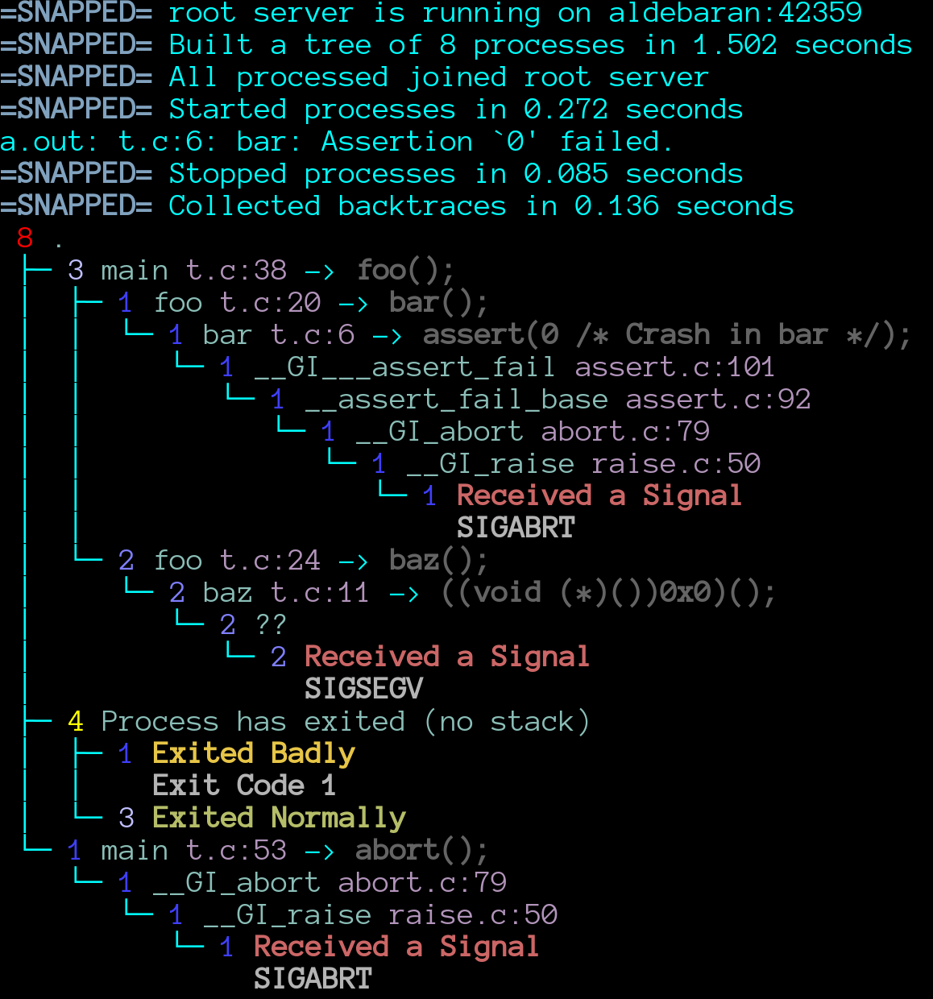

# Snapped

**Snapped** is a parallel program snapshotter designed for debugging deadlocks and crashes in programs. It acts as a wrapper around the GDB Machine Interface (GDB-MI), leveraging the capabilities of GDB to provide robust debugging features. **Snapped** is implemented in Rust.



## Features

- **Direct Debugging:** Snapped allows you to directly debug a program by taking snapshots at the point of failure.
- **Parallel Debugging:** Designed to handle parallel processes, Snapped can connect to thousands of processes using a tree-based overlay network, making it suitable for debugging distributed applications.

## Installation

Before using Snapped, you need to ensure that you have Rust installed. If you haven't installed Rust yet, you can do so by following these steps:

### Install Rust using rustup

1. Install `rustup` by executing the following command in your terminal:
    ```sh
    curl --proto '=https' --tlsv1.2 -sSf https://sh.rustup.rs | sh
    ```
2. Follow the on-screen instructions to complete the installation.
3. Add `rustup` to your system's `PATH` by sourcing the `cargo` environment variables:
    ```sh
    source $HOME/.cargo/env
    ```

### Build and Install Snapped

Once Rust is installed, you can build and install Snapped:

```sh
git clone https://github.com/besnardjb/snapped
cd snapped
cargo build --release
```

The `snapped` binary will be located in the `target/release` directory.

### Build a LibC independent version

If you need to deploy on a machine quickly without building remotely you may build a fully static binary using the `musl` LibC by doing the following:


```bash
# Add musl based libc build (static binaries)
rustup target add x86_64-unknown-linux-musl
# Build over static libc
cargo build --target x86_64-unknown-linux-musl --release
# Copy to REMOTE
scp ./target/x86_64-unknown-linux-musl/release/snapped REMOTE:
# Enjoy
```

## Usage

Snapped provides a straightforward interface for debugging your programs. Below are some common usage patterns:

### Direct Debugging

To debug a program directly, use the following command:

```sh
snapped ./a.out
```

This command runs the program `a.out` under Snapped, allowing you to take snapshots for debugging.

### Parallel Debugging

For parallel or distributed applications, you can run Snapped in parallel debugging mode:

```sh
snapped -p 128 mpirun -np 128 snapped ./a.out
```

or

```sh
snapped -p 128 srun -n 128 snapped ./a.out
```

In this mode, Snapped acts as a GDB server for each process, allowing for comprehensive debugging across multiple instances.
If the program crashes or if you hit CTRL+C once you should get a snapshot of the program state.

## Options

Snapped supports several options to customize its behavior:

- `-i, --interrupt-after <INTERRUPT_AFTER>`  
  Interrupt the program after a specified number of seconds. Note CTRL+C (once) will also interupt.
  
- `-r, --root-server <ROOT_SERVER>`  
  Set up the program to backconnect to a root debugger instance.
  
- `-p, --pivot-processes <PIVOT_PROCESSES>`  
  Act as a GDB server for debugging parallel processes.

- `-h, --help`  
  Display the help message with all available options.

## Contributing

Contributions are welcome! Please feel free to submit a pull request or open an issue on the GitHub repository.

## License

ParaTools, All Rights Reserved
Contact info@paratools.com for further information
